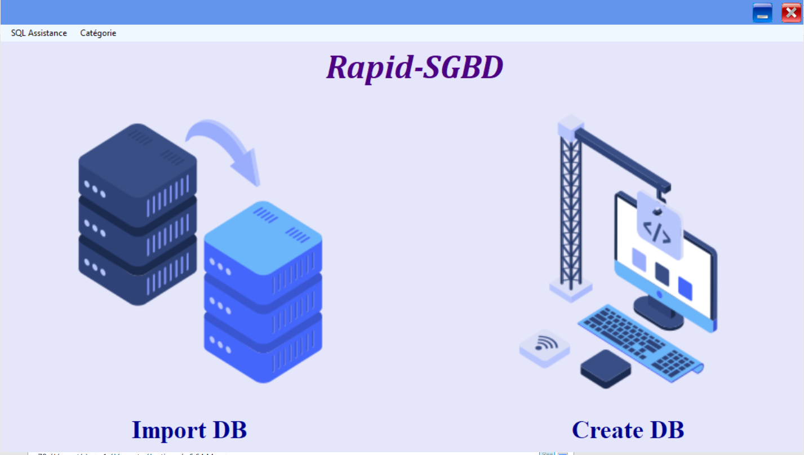

# Rapid-SGBD: Accelerating Database Management

Welcome to **Rapid-SGBD**, an innovative project designed to streamline and expedite your database management experience. Whether you're a database professional, a trainer, or a student, our mission is to provide you with a comprehensive set of tools that make working with Database Management Systems (DBMS) a breeze.
s

## Key Objectives and Features

1. **Efficient Data Exchange:**  
   Rapid-SGBD aims to simplify collaboration by enabling swift exporting and importing of database scripts, tables, and records. Say goodbye to time-consuming detachment and reattachment processes. Collaborate seamlessly with colleagues and peers.

2. **Simplified Database Creation:**  
   Creating databases and crafting SQL tables should be straightforward. Rapid-SGBD offers an intuitive interface that guides you through the process, ensuring you can set up databases and tables with ease.

3. **Smart Data Population:**  
   Once tables are in place, Rapid-SGBD empowers you to populate columns using real-world data categories or random values, based on your table schema. Populate tables quickly with the desired number of rows for efficient testing and development.

4. **Category Management:**  
   Leverage a library of predefined categories or customize your own as per your project's requirements. Rapid-SGBD gives you the flexibility to manage and tailor categories to suit your data needs.

5. **Diverse Export Options:**  
   After populating your tables, choose from various export formats including SQL, XML, JSON, HTML, XSL, and CSV. Alternatively, generate comprehensive SQL scripts for your entire database, ensuring seamless data sharing.

## Experience the Future of Database Management

Experience the future of database management with Rapid-SGBD. Our user-friendly tools are engineered to save you time, boost efficiency, and enhance collaboration. Get started today and see how Rapid-SGBD transforms your database tasks into a rapid, hassle-free experience.

## Zakariae el Hajri
