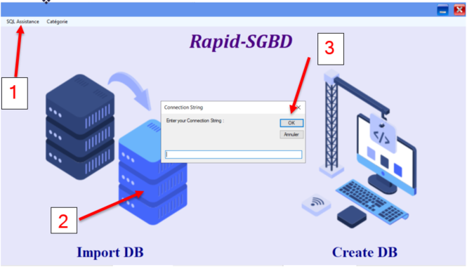

# Getting Started Guide

To get started with Rapid-SGBD, follow these steps:



1. **Clone the Repository:**
   Clone the Rapid-SGBD repository to your local machine using the following command:

   ```bash
   git clone https://github.com/your-username/Rapid-SGBD.git
**Import Existed Database:**


Open the main interface.
Click on the "Import Database" option.
Steps:

Set the connection string to your existing database.
Proceed with the import process.


All tables from the database will be imported.

Export Imported Tables:


After importing tables from the database, you have various export options available. Choose the appropriate option for your needs.

**Create New Database:**


Click the "Create New Database" button.
Steps:

Enter a name for the new database.
Add tables by clicking the "Add Table" button.
Set table names and add columns as needed.


Column Properties:

Define column properties such as name, type (primary key, null, unique, default), etc.


Display available categories for columns.


Choose a category for the column.


Interface to generate a specified number of records for the created table.


Generate test data for the table.


View the results of the generated data.

Download a script for the created table with the generated data. The script can automatically create the database with the table and generated data.


Configure application parameters.


Access application options and settings.


Explore various application parameters.
Congratulations! You've successfully started your journey with Rapid-SGBD. Feel free to explore the features and unleash the potential of streamlined database management.
